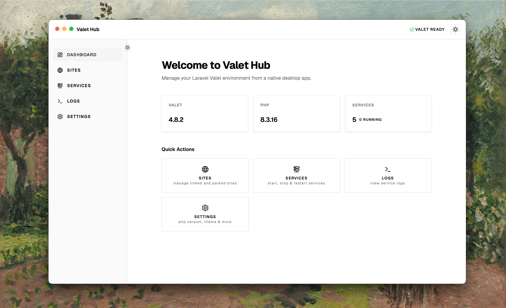

  

  <strong>Desktop companion for Laravel Valet.</strong>
   
  Manage your Valet sites, services, and configuration from a native macOS app.

  <a href="#download">Download</a> ·
  <a href="#screenshots">Screenshots</a> ·
  <a href="#features">Features</a> ·
  <a href="#reporting-issues">Report an Issue</a> ·
  <a href="#feature-requests">Feature Requests</a> ·
  <a href="#changelog">Changelog</a>

  
  
  
  

---

## Download

Download the latest `.dmg` from the [Releases page](https://github.com/htooaungphyolwin/valet-hub-releases/releases/latest).

**Requirements:**
- macOS 14 (Sonoma) or later
- [Laravel Valet](https://laravel.com/docs/valet) installed and running
- PHP 8.x (managed by Valet)

**Quick start:**
1. Download the `.dmg`
2. Drag Valet Hub to Applications
3. Launch — it auto-detects your Valet setup

> Your existing Valet sites and services are detected immediately. No configuration needed.

---

## Screenshots

<picture>
  <source media="(prefers-color-scheme: dark)" srcset="assets/valet-hub-screenshot-dark.png">
  
</picture>

---

## Features

- **Site Management** — Link, park, secure, and isolate PHP versions for Laravel sites
- **Service Control** — Start, stop, restart Nginx, PHP, MySQL, Redis
- **Routes Viewer** — Browse all Laravel routes grouped by prefix, with one-click source access
- **Log Viewer** — Real-time Nginx error logs with filter-by-site
- **Environment Info** — PHP versions, database connections, tech stack at a glance
- **Native macOS** — Custom titlebar, keyboard shortcuts, and native feel

---

## Reporting Issues

Found a bug? Open an issue on the [releases repository](https://github.com/htooaungphyolwin/valet-hub-releases/issues/new/choose).

**Before opening an issue:**
1. Check that you're on the latest version
2. Search existing issues to avoid duplicates
3. Include your macOS version and Valet version (`valet --version`)
4. Attach screenshots or screen recordings if relevant

**Good issue titles look like:**
- "Service control: PHP restart button does nothing"
- "Site list: parked site not showing after `valet park`"
- "Crash: Valet Hub quits when switching PHP versions"

---

## Feature Requests

Have an idea? Open a feature request on the [releases repository](https://github.com/htooaungphyolwin/valet-hub-releases/issues/new/choose).

**Before requesting:**
1. Search existing issues and discussions — your idea may already be planned
2. Describe the problem you're solving, not just the solution
3. Explain how it fits into the Valet workflow

**Examples of good feature requests:**
- "Add dark mode support for the logs view"
- "Show a notification when a site's PHP version changes"
- "Support config editing for `.valetrc` and `Nginx` site configs"

---

## Changelog

See the [Releases page](https://github.com/htooaungphyolwin/valet-hub-releases/releases) for a per-release changelog.

---

  
    Built for the Laravel Valet community. Made with ❤️.
     
    <a href="https://valethub.vercel.app">Documentation</a>
  

